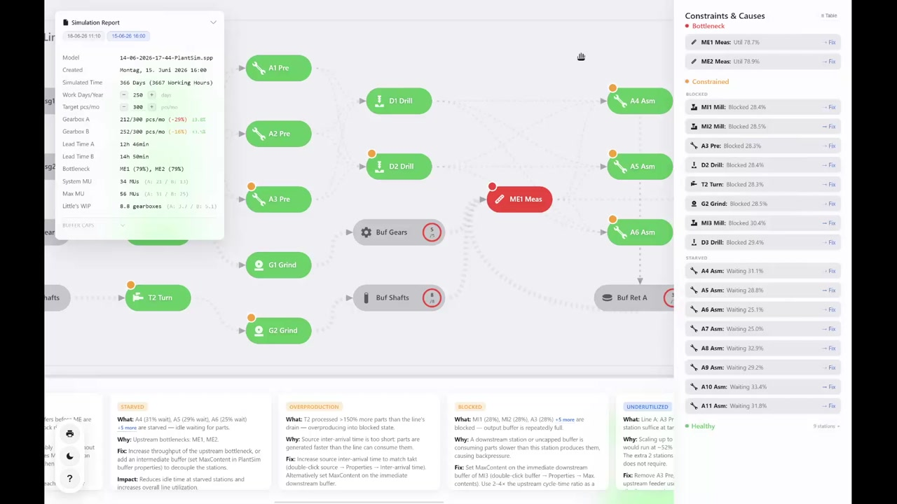

# PlantSim Gearbox Visualizer

A premium, interactive dashboard for visualizing and analyzing production line simulation results exported from **Tecnomatix Plant Simulation**.

## Overview

The PlantSim Visualizer is a fully client-side, zero-dependency web application that transforms raw HTML table reports generated by Plant Simulation into a sleek, actionable, interactive topology map.

Rather than manually digging through table rows, users drag and drop their PlantSim HTML report into the browser. The tool immediately maps the facility layout and generates actionable insights on bottlenecks, material flow, WIP, and equipment utilization.

## Demo

https://github.com/user-attachments/assets/0b482fbd-b6ad-4b97-b5c0-1c06232a4b0f

**Fallback** (for mirrors that don't render the inline player above):

▶ **[Watch the demo (2:39)](Demo_compressed.mp4)** — click the image above.

## Core Features

- **Interactive D3.js Flow Map:** Dynamically generated topology graph covering every machine, buffer, source, and assembly station across Line A and Line B. Supports zoom, pan, and click-to-inspect.
- **Drag-and-Drop Processing:** Fully client-side parsing. Simulation data never leaves your computer. Drop any `results_*.htm` file onto the screen.
- **Intelligent Diagnostics Engine:**
  - **Three-tier constraint display:** Red = Bottleneck (util > 75%, waiting < 5%); Amber = Constrained — sub-grouped as *Blocked* (> 28%) or *Starved* (> 20% waiting); Green = Healthy
  - **Dynamic threshold adjustment:** If no primary bottleneck exists and over 55% of active machines exceed the blocked threshold (system-wide takt rhythm), the effective threshold auto-raises to the 75th percentile (capped at 40%) so genuine outliers still surface
  - Stations with zero entries (Future / For Sale) are always classified Healthy — their 100% waiting time is a data artefact, not a constraint
  - Optimization cards are automatically suppressed when all targets are Healthy; the bottom bar hides completely when no actionable issues remain
  - Warns on **unmatched nodes** (stations in TOPOLOGY absent from the report)
- **Production KPIs with Statistical Confidence:**
  - Gearbox A/B output in pcs/month, normalized to a real factory calendar via an editable Work Days/Year field
  - Poisson 95% CI shown inline (±%) — color-coded green/amber/red by sample size
  - Deviation vs. target highlighted in color
  - Bottleneck station list in the KPI pill with `+N more` hover tooltip for overflow
  - **System MU** — net parts in the system at run end (entries − exits across all stations)
  - **Max MU** — peak simultaneous MU count (sum of per-station Max Contents)
  - **Little's WIP** — finished gearboxes simultaneously in the system via Little's Law: `(pcs/month ÷ 30.42) × (lead time in days)`; directly comparable between lines and versions regardless of sub-part count
- **Plant Simulation–Specific Recommendations:** Eight diagnostic rules generate actionable fix cards using correct Tecnomatix terminology (Min. Contents exit strategy, exitLocked SimTalk, MaxContent buffer caps). Cards are labeled by issue type — not generic WARNING/INFO:
  - `R_GEN_BOTTLE` — **Bottleneck:** advises duplicating ME1/ME2 as parallel stations with Min. Contents on feeders and return buffer
  - `R_GEN_BALANCE` — **Exit Strategy:** names the exact fan-out point and dialog setting to change
  - `R_PLANTSIM_GATING` — **Deadlock Risk:** warns when ME is bottleneck and part buffers near ceiling; provides entrance-control SimTalk snippet
  - `R_GEN_STARVED` — **Starved:** traces to upstream bottleneck
  - `R_GEN_OVERPROD` — **Overproduction:** flags a blocked station processing far more than drain output
  - `R_GEN_BLOCK` — **Blocked:** identifies stations whose output buffer is repeatedly full (> 28% blocked); names the specific downstream buffer to cap
  - `R_GEN_BUFFER` — **WIP Buildup:** buffer accumulating net WIP across the run
  - `R_GEN_RIGHTSIZE` — **Underutilized:** surplus parallel stations at the output target; correctly handles imbalanced routing (uses busiest station's util directly, not N × util)
  - `R_GEN_NOMATCH` — **Unmatched:** stations that couldn't be matched to report data
- **`+N more` overflow tooltip:** Station names that overflow a rec card or KPI pill are replaced with a `+N more` chip; hovering reveals the full list.
- **Help Inspect Mode:** Press `?` to enter an interactive help mode. The cursor becomes a pointer+badge; clicking any element shows a glassmorphism popup describing exactly what that element does — including human-readable formulas for every KPI. Escape dismisses the popup; a second Escape exits help mode.
- **Apple-like UI:** Dark-mode glassmorphism, liquid-glass FAB pill tray, 8-point grid, SF Pro / Inter typography, CSS micro-animations, `@media (prefers-reduced-motion)` guard. Full light-mode support. Theme toggle icon shows the *target* state (☀️ in dark mode, 🌙 in light mode).
- **Single-File Portability:** Zero build steps, zero `npm install`. The entire app is one portable `gearboxsim.html` file (~4 600 lines).

## Usage

1. Open `gearboxsim.html` in any modern browser (Chrome, Edge, Firefox, Safari).
2. Export simulation results from Plant Simulation as an HTML report (`results_*.htm`).
3. Drag and drop the file onto the dashboard.
4. Explore nodes (hover for tooltip, click for Node Details), review the Simulation Report pill, and read the Constraints & Recommendations cards.

## Architecture & Tech Stack

- **HTML5 & CSS3:** CSS variables, Grid/Flexbox, glassmorphism — no UI framework
- **Vanilla JavaScript:** DOMParser-based HTM parsing, state management, D3 orchestration
- **D3.js v7 (CDN):** Zoomable/pannable SVG topology map

## File Structure

- `gearboxsim.html` — Core application (CSS, inline SVG symbols, HTML, JavaScript)
- `results_*.htm` — PlantSim HTML output files used for development and testing
- `README.md` — This file
- `Handoff_18-06-26.md` — Technical handoff document for AI-assisted development (supersedes `Handoff_15-06-26.md`)
- `documentation.md` — Validated PlantSim model configuration: exit strategies, buffer caps, grinder-gating SimTalk

## Customization

Edit `TOPOLOGY.nodes` and `TOPOLOGY.edges` inside the `<script>` block to map a different Plant Simulation layout. Each node requires: `id`, `searchId` (substring matched against HTM row keys), `line` (`'A'` or `'B'`), optional `subtype` (secondary substring match), `label`, `col`, `row`, and type flags (`isSource`, `isBuffer`, `isDrain`).

Thresholds (bottleneck %, starvation %, target output, etc.) are centralized in the `CONFIG` object at the top of the script block.
